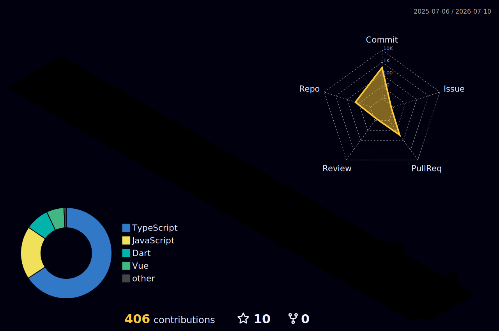

<h1 align="center">Hi, I'm Pattarapon</h1>

  UX/UI Designer · Prototyping with AI (vibe coding) · Bangkok, Thailand

  <b>Design:</b> Figma · Design Systems · UX Research 
  <b>Build:</b> React · Vite · MapLibre · Cloudflare Workers

---

## GitHub Stats

  
  

  

  

  

